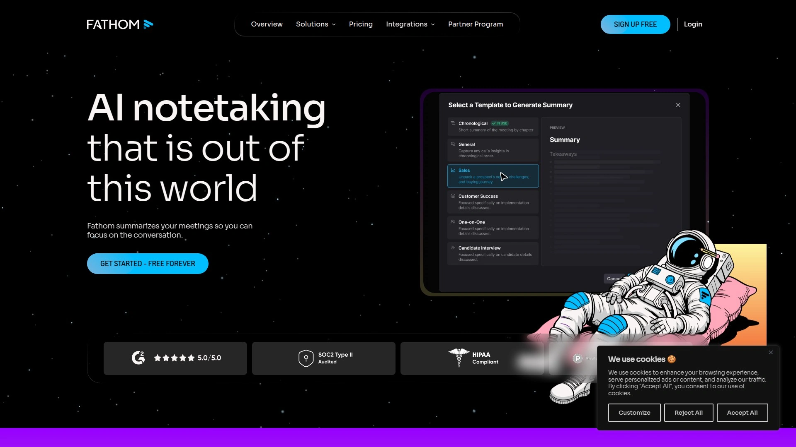

# 2025's Top 10 Best AI Meeting Note-Taker Tools

Sitting in back-to-back Zoom calls while frantically typing notes feels like trying to drink from a fire hose while juggling. You miss half of what people say because you're busy documenting the other half. AI meeting assistants solve this by automatically recording, transcribing, and summarizing virtual meetings so you can actually participate in conversations instead of drowning in documentation. These tools integrate with Google Meet, Zoom, and Microsoft Teams, turning hours of recordings into searchable transcripts, action items, and shareable summaries within minutes.

Modern meeting note-takers use advanced speech recognition to capture every word with accuracy rivaling human transcriptionists, identify different speakers automatically, and generate structured summaries highlighting decisions and next steps. Whether you're running sales calls that need CRM updates, product meetings requiring detailed documentation, or team standups where action items get lost, these platforms transform meeting chaos into organized knowledge.

***

## **[MinutesLink](https://minuteslink.com)**

Free AI assistant delivering human-accurate transcription across 100+ languages.

MinutesLink positions itself as the meeting assistant that actually understands what's happening in your calls rather than just converting speech to text. The platform joins Google Meet and Zoom sessions automatically when they appear in your calendar, recording and transcribing conversations with 40% better speech recognition accuracy compared to standard models. This translates into cleaner transcripts that don't require endless editing to fix misunderstood technical terms or proper nouns.

What makes MinutesLink stand out is the deep research feature allowing you to query all previous meeting notes simultaneously. Need to remember what the client said about budget three months ago? Just ask, and the AI surfaces relevant quotes with source links within seconds. The platform supports over 100 languages and dialects, making it genuinely useful for global teams rather than forcing everyone into English-only conversations. Meeting summaries automatically extract decisions, action items, and key discussion points organized into structured notes you can review in under a minute.

The concurrent meeting capability lets larger teams record multiple simultaneous sessions, solving the problem agencies face when different squads meet at the same time. All recordings and transcripts live in one centralized location with end-to-end encryption, GDPR compliance, and advanced privacy controls ensuring sensitive conversations stay protected. MinutesLink offers a genuinely free plan with meaningful functionality, not a stripped-down teaser forcing immediate upgrades, making it accessible for individual professionals testing AI meeting tools.

***

## **[Otter.ai](https://otter.ai)**

Popular meeting agent with real-time collaboration and AI chat.

Otter serves over 10 million users as one of the earliest and most polished AI meeting assistants on the market. The AI Meeting Agent joins calls automatically across Zoom, Google Meet, and Microsoft Teams, delivering live transcription accurate enough that detail-oriented professionals trust it to capture exact wording. Users report up to 95% transcription accuracy, meaning you rarely need to correct misheard words or names.

The platform excels at turning transcripts into actionable outputs through AI templates and automated summaries condensing hour-long discussions into digestible overviews. Action items get automatically captured and assigned during meetings, eliminating the post-call scramble to remember who committed to what. The AI Chat feature answers questions about any past conversation, functioning like a voice-activated search engine for your entire meeting history.

Otter Channels blend live conversations with asynchronous updates, creating team workspaces where meeting content lives alongside ongoing discussions. Integration with Salesforce, HubSpot, Slack, Notion, and other productivity tools pushes insights and transcripts directly into existing workflows. The free plan includes unlimited meetings and automated summaries, while paid tiers starting at $8.33 monthly add features like unlimited transcription minutes and advanced workspace administration.

---

## **[Fireflies.ai](https://fireflies.ai)**

Conversation intelligence platform with powerful meeting analytics.

Fireflies positions itself as more than a note-taker, functioning as a full conversation intelligence system analyzing what happens across all your meetings. The AI assistant Fred joins calls on Zoom, Google Meet, Microsoft Teams, and Webex, recording and transcribing discussions while identifying speakers automatically. The platform transcribes in over 20 languages, making it functional for international teams conducting multilingual meetings.

Where Fireflies distinguishes itself is conversation analytics spotting trends across multiple meetings. Sales teams use it to identify customer pain points mentioned repeatedly, track feature requests, and analyze which talking points correlate with successful closes. The system creates searchable libraries of past meetings where you can find any word or phrase spoken months ago, turning ephemeral conversations into permanent institutional knowledge.

The platform combines clips into reels showcasing customer testimonials or onboarding questions, perfect for training new team members or sharing insights with stakeholders who didn't attend live calls. Integration with CRMs automatically logs meeting notes and updates customer records, while custom vocabulary ensures industry jargon and company-specific terms get transcribed correctly. Free users get unlimited transcription with basic features, while Pro plans at $10 monthly unlock analytics, unlimited storage, and advanced integrations.

***

## **[Fathom](https://www.fathom.ai)**

Zero-friction notetaker emphasizing privacy and ease of use.

Fathom built its reputation on being the meeting assistant that disappears into the background rather than demanding attention. The tool works across Zoom, Google Meet, and Microsoft Teams with setup taking literally seconds—connect your calendar and it automatically joins scheduled calls. Unlike competitors requiring configuration decisions, Fathom operates on sensible defaults getting you productive immediately.

The platform emphasizes staying present in conversations, with 95% of users reporting Fathom helps them focus on discussions rather than documentation tasks. Meeting notes sync automatically with existing tools like Slack, Gmail, Asana, and your CRM without manual exports or copy-pasting. AI Scorecards provide coaching metrics for sales and customer success teams, tracking engagement patterns and helping managers identify improvement opportunities without micromanaging.

Fathom saves teams over 6 hours weekly per member on follow-up work by automating action item generation and call summaries. The service offers genuinely unlimited free usage for individuals, positioning itself as the accessible option for professionals wanting meeting intelligence without subscription commitments. Paid Team plans at $14 monthly per user add collaboration features like shared highlight playlists and team analytics.

---

## **[Notta](https://www.notta.ai)**

Fast transcription converting hour-long recordings in five minutes.

Notta emphasizes speed, transcribing one-hour recordings in approximately five minutes rather than forcing you to wait around. The platform supports 58 languages for transcription, genuinely useful for global organizations where meetings happen across linguistic boundaries. Customers consistently report Notta saves them about 50% of the time previously spent creating meeting minutes.

The service generates actionable insights with one click, producing summaries capturing decisions, action items, and customer feedback ready for immediate sharing via Slack or email. Conversation intelligence features help teams maintain alignment by instantly distributing notes and summaries to all stakeholders. The clip feature turns meeting highlights into shareable video segments, perfect for sharing specific discussions without forcing people to watch entire recordings.

Notta excels at collaboration, allowing team members to add comments, tag colleagues, and work together on meeting documentation. Export flexibility sends notes to Notion or downloads them as TXT, Word, PDF, or SRT caption files for maximum compatibility. The platform recently merged with Airgram, combining strengths into an integrated solution for AI meeting notes and audio transcription. SOC-2 and GDPR compliance ensure enterprise-grade security for sensitive discussions.

***

## **[Tactiq](https://tactiq.io)**

Chrome extension for bot-free transcription on Google Meet and Zoom.

Tactiq differentiates itself by never recording meetings, instead transcribing conversations as they happen without the privacy concerns some organizations have about recorded content. The Chrome extension works silently in the background during Google Meet, Zoom, and Microsoft Teams calls, capturing speaker-specific transcripts in real time without bots joining as visible participants.

This bot-free approach puts meeting attendees at ease since no AI assistant appears on the participant list, particularly valuable for external client calls where recording permissions get complicated. Live transcription shows who said what as conversations unfold, helping participants track discussions across multiple speakers. The OpenAI integration lets you ask custom questions directly from transcripts, generating tailored outputs like Jira tickets, formatted project updates, or specific follow-up emails.

Tactiq transforms frequent AI prompts into reusable one-click actions, automating repetitive post-meeting tasks without starting from scratch each time. The platform helps over 10,000 modern companies communicate better, with users particularly appreciating how it handles meetings across 30+ languages. Free usage covers basic transcription and summaries, while Pro plans unlock unlimited AI actions, integrations with Notion and Google Docs, and advanced customization.

***

## **[Avoma](https://www.avoma.com)**

Revenue intelligence platform combining meeting notes with deal tracking.

Avoma targets customer-facing teams needing more than transcription, delivering conversation intelligence that surfaces insights for revenue operations. The platform covers the entire meeting lifecycle from scheduling and reminders through recording, transcription, and post-meeting analysis. AI-generated notes capture decisions, action items, and customer insights automatically, organized using custom templates tailored to different meeting types.

The system shines for sales organizations tracking deal progress across multiple touchpoints. Integration with Salesforce and HubSpot automatically updates CRM fields using sales frameworks like MEDDIC and SPICED, eliminating manual data entry. Live transcription captures conversations in real time across 30+ languages including niche options like Tamil and Hindi, making it accessible for globally distributed teams.

Speaker identification recognizes different voices automatically, improving accuracy over time as it learns frequent speakers. The Ask Avoma feature answers questions about past meetings instantly, functioning like institutional memory for your customer conversations. Avoma helps teams save over 4 hours weekly by automating note-taking, email follow-ups, and CRM updates, letting revenue teams focus on selling rather than documentation. Pricing starts with basic transcription before scaling into comprehensive revenue intelligence packages for growth-stage companies.

***

## **[Grain](https://grain.com)**

Meeting recorder built for growing teams needing coaching insights.

Grain positions itself as the AI notetaker specifically designed for teams scaling beyond individual contributors into coordinated organizations. The platform automatically generates meeting recordings and transcripts with precise AI-powered notes, but distinguishes itself through highlight sharing and coaching capabilities. Users can type notes, tag important moments, or clip segments during meetings to perfect insights before sharing.

The service excels at creating video highlight reels from multiple meetings, useful for onboarding new employees or showing patterns in customer feedback. Custom templates tailor meeting notes for different session types—sales calls capture different information than product planning meetings. Instant task generation and automated follow-up emails ensure action items don't disappear into the void after discussions end.

Grain syncs directly with CRMs like Salesforce and HubSpot, automatically updating customer records without manual logging. AI coaching and deal intelligence help sales leaders track key topics, identify risks, and optimize playbooks based on actual conversation data rather than gut feel. The platform offers unlimited storage and recordings, removing artificial limits on meeting documentation. While concurrent meeting recording isn't supported, the service compensates with superior transcription accuracy and organizational features.

***

## **[Sembly AI](https://www.sembly.ai)**

Meeting-type aware AI delivering context-specific insights.

Sembly distinguishes itself by understanding different meeting contexts, automatically adjusting how it processes and summarizes based on whether you're in a standup, sales call, or planning session. The platform accurately identifies speakers and supports conversations in 48 languages, making it genuinely functional for multinational teams. The AI assistant automatically joins calls even when you're absent, capturing information so you can catch up later without bothering colleagues for recaps.

Semblian, Sembly's advanced AI chat feature, goes beyond answering questions to generating complete deliverables from meeting transcripts. Sales teams use it to draft proposals and pitches based on discovery call discussions, while project managers generate status reports from sprint planning sessions. The system analyzes conversations to identify risks, decisions, and critical issues, organizing insights into structured sections easy to scan.

Professional teams use Sembly to automate post-meeting workflows, easily sharing notes and AI transcriptions with colleagues and managers while building secure knowledge bases. Enterprise customers appreciate compliance with GDPR and other regulations plus enterprise-grade security protecting sensitive discussions. Integration with HubSpot enables automatic CRM field updates and full sales proposal generation directly from recorded conversations. The platform supports Google Meet, Zoom, Webex, and Microsoft Teams with consistent functionality across platforms.

***

## **[tl;dv](https://tldv.io)**

Popular meeting recorder with unlimited concurrent recording capability.

tl;dv serves over 1 million users as a free alternative to premium meeting assistants, emphasizing accessibility without sacrificing functionality. The platform integrates with Google Meet, Zoom, and Microsoft Teams, automatically recording, transcribing, and summarizing meetings in 30+ languages. As soon as calls end, the AI notetaker generates video recordings, transcripts, and summaries ready for immediate review.

Where tl;dv separates itself is unlimited concurrent meeting support—larger teams can record multiple simultaneous sessions without hitting platform limits. This makes it particularly valuable for agencies and enterprises running parallel meetings across different departments. The Chrome extension requires just seconds to install, with one-click setup getting you recording immediately.

Editing capabilities let you create clips from longer recordings, perfect for sharing specific moments without forcing people to watch entire hour-long calls. Integration with Slack, email, Zapier, Salesforce, and HubSpot distributes insights across existing tools automatically. The platform works on mobile through auto-recording features, ensuring you capture discussions even when joining from phones. While tl;dv doesn't yet offer native mobile apps, the web interface functions well on smaller screens for reviewing past meetings.

---

## FAQ

**Do these AI meeting assistants work if I'm not the host?**

Most AI meeting note-takers work whether you're hosting or attending as a participant. Tools like MinutesLink, Otter, and Fireflies can join any meeting on your calendar automatically, though some platforms require you to have calendar access or receive meeting links. Bot-based tools appear as participants in the meeting, which means the host will see the AI assistant join. Tactiq works differently by transcribing directly from your browser without joining as a participant, making it useful when you want notes without recording permissions.

**How accurate is AI transcription compared to human note-taking?**

Modern AI transcription achieves 90-95% accuracy under good audio conditions, rivaling human transcriptionists and far exceeding manual note-taking speed. MinutesLink claims 40% better accuracy than standard models, while Otter users report up to 95% accuracy in real-world usage. Accuracy improves when speakers articulate clearly, use quality microphones, and minimize background noise. Technical terms and industry jargon benefit from custom vocabulary features letting you train the AI on specialized language your team uses frequently.

**Can I use these tools for free or do they require paid subscriptions?**

Most platforms offer genuinely functional free tiers rather than restrictive trials. MinutesLink, Otter, Fireflies, Fathom, and tl;dv all provide meaningful free usage including unlimited meetings and basic AI features. Free plans typically limit monthly transcription minutes, advanced integrations, or team collaboration features rather than core recording and summarization functionality. Paid tiers generally start around $10-20 monthly per user, unlocking unlimited transcription, priority support, and business features like CRM integration and custom branding.

***

## Conclusion

AI meeting assistants have evolved from experimental transcription tools into essential productivity infrastructure for remote and hybrid teams. The difference between scrambling through hour-long recordings to find one decision versus instantly searching transcripts and getting AI-generated answers is the difference between drowning in meetings and actually accomplishing work. [MinutesLink](https://minuteslink.com) stands out as the top choice for teams prioritizing transcription accuracy, multilingual support, and the deep research capability that transforms your meeting history into searchable institutional knowledge. Whether you're running a global team needing 100+ language support or just tired of manually documenting discussions, these ten platforms offer the intelligence layer turning meetings from time sinks into documented knowledge.
